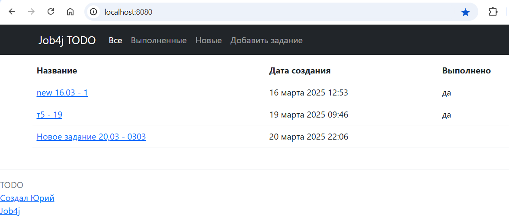

# job4j_todo
Приложение для управления задачами.  
Позволяет добавлять новые задачи, редактировать, выполнять и удалять задачи.  
Есть возможность просматривать список всех задач, новых, выполненных. 

# Стек технологий:  
Java 19  
PostgreSQL 16.2  
Spring Boot 2.7.6  
Maven 3.9.6  
Liquibase Maven Plugin 4.15.0  
JaCoCo Maven Plugin 0.8.8  
SQL2O 1.6.0

# Требования к окружению
Microsoft Windows 11  
Java 19  
PostgreSQL 16

# Запуск проекта:
Создать локальную копию проекта клонированием из репозитория https://github.com/GitHubfilipich/job4j_todo  
В PostgreSQL создать базу данных и в папке проекта в файлах "...\db\liquibase.properties" и
"...\src\main\resources\application.properties" указать её адрес (url), имя пользователя (username) и
пароль (password).  
В терминале в папке проекта выполнить скрипты создания БД таблиц командой "mvn liquibase:update -Pproduction".  
Создать исполняемый файл проекта "job4j_todo-1.0-SNAPSHOT.jar" в папке "target" проекта командой
"mvn clean package -Pproduction -DskipTests".  
Запустить исполняемый файл командой "java -jar target/job4j_todo-1.0-SNAPSHOT.jar".  
Сайт проекта находится по адресу http://localhost:8080/

# Взаимодействие с приложением:
Главная страница - выбор списка всех, выполненных, новых задач, создание новой задачи, редактирование текущей.

Список выполненных задач

Список новых задач

Страница создания новой задачи - сохранение новой задачи

Страница просмотра задачи - выполнение, редактирование, удаление задачи

Страница редактирования задачи - сохранение изменений

# Контакты
https://github.com/GitHubfilipich